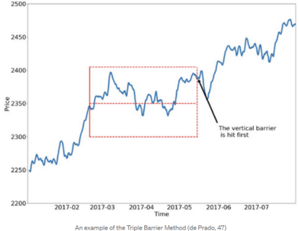

# KPTL Quant Challenge

Há 15 anos, a [KPTL](https://kptl.com.br/fundo-bohr2/) investe em empresas inovadoras. Com o lançamento de nossos Fundos Quantitativos, passamos a usar tecnologia também na gestão de ativos. Nossos modelos matemáticos, aliados a Big Data conjuntamente com técnicas de Machine Learning amplificam nossos resultados.


## O Desafio

Nosso primeiro desafio é destinado aqueles que sonham em trabalhar no mundo quantitativo, aliando a competitividade do mercado financeiro à tecnologia de ponta, utilizando computação em nuvem e Big Data. 

Nesse primeiro Challenge, decidimos iniciar com a abertura de duas vagas: uma para dados e outra para modelagem. Basta resolver os desafios abaixo, e enviar para os emails: adriano.soares@kptl.com.br e gustavo.vieira@kptl.com.br, com o títutlo `KPTL Quant Challenge`.

### Vaga para o time de Dados

O time de dados é a estrutura chave para auxiliar e prover o combustível para os modelos. Se você deseja aventurar-se no mundo da estruturação de dados, dos serviços de computação em nuvem da AWS e criar pipelines de ETL de forma escalável e sustentável para Big Data, seu lugar é aqui!

### Vaga para o time de Modelagem

O time de modelagem tem em seu núcleo o apreço pela criativade e aprendizagem, pois além de engenheiros, somos pesquisadores. Esta vaga é dedicada aos amantes de matemática e estatística, com entendimento prévio e noções de todo pipeline de criação de modelos de Machine Learning, desde uma análise profunda dos dados até a exibição de métricas de performance do modelo. Se pretende atuar sempre em alta performance, estudar algoritmos state of art, aplicando isso no mercado de cripto 24/7, seu lugar é aqui.

## Remuneração e Oportunidades

Buscamos pessoas que queiram trabalhar conosco e com possibilidade de se tornarem sócios futuramente. Cobramos e valorizamos dedicação e resiliência. As vagas são preferencialmente para estágio, horário flexível e trabalho remoto com visitas esporádicas no [escritório](https://www.google.com/maps/place/R.+Prof.+Tamandar%C3%A9+Tol%C3%AAdo,+69+-+15%C2%BA+Andar+-+Itaim+Bibi,+S%C3%A3o+Paulo+-+SP,+04532-020/@-23.5838219,-46.6767013,17z/data=!3m1!4b1!4m5!3m4!1s0x94ce575e8eb74d69:0xe15479525fe05e8c!8m2!3d-23.5838219!4d-46.6745126) de São Paulo.

Remuneração básica: R$ 3000,00 + possível bônus anual (a dependender da performance).

## Desafio de Dados

### Webscrapping e Parsing CVM (Comissão de Valores Mobiliários).

Dados de informes diários dos fundos: http://dados.cvm.gov.br/dados/FI/DOC/INF_DIARIO/DADOS/


Dados cadastrais dos fundos:  http://dados.cvm.gov.br/dados/FI/CAD/DADOS/


### Passo 1
Extraia os dados da CVM salvando em um destino parametrizável, aqui é interessante sugerir qual tipo de banco de dados usar para salvar os dados "crus". Para este caso pode ser em uma pasta (com nome raw) no formato de CSV/parquet, mas que seja fácil modificar o destino (alguns exemplos de possíveis destinos: AWS S3, MongoDB, MySQL, etc…).

> Dica: Como agilizar o processo de extração?

### Passo 2
1. Faça um ETL desses dados salvos em uma nova pasta (de preferência utilizando spark/pyspark) fazendo um mapping do CNPJ para o nome. 

2. Crie [velas/barras OHLC](https://www.investopedia.com/terms/c/candlestick.asp) mensais e anuais para a coluna VL_QUOTA.

3. Agrege as demais colunas numéricas como média ou mediana do período.

Ao final deste processo os dados devem estar no seguinte esquema:

```python
DENOM_SOCIAL : fund_name: str,
TP_FUNDO     : fund_type : str,
CNPJ_FUNDO   : fund_cnpj: str ,
DT_COMPTC    : timestamp: datetime ,
VL_TOTAL     : total_wallet : float,
VL_QUOTA     : daily_close: float,
VL_PATRIM_LIQ: net_worth : float,
CAPTC_DIA    : daily_fundraising : float,
RESG_DIA     : daily_withdraw : float,
NR_COTST     : number_shareholders : int,
TAXA_ADM     : administration_tax: float,
TAXA_PERFM   : performance_tax: float
```

onde os nomes da esquerda são antes e o da direita depois. Não se esqueça de incluir as colunas de open, high, low, close, interval (mês ou ano). a pasta destino desses dados deve ser chamada de "staging"

### Passo 3
1. Retorne um dataframe filtrando apenas os fundos que contenham "crypto" ou "cripto" em sua denominação social
   
2. Crie funcionalidades que calculem o retorno, desvio padrão, retorno log, dentre outras métricas de sua vontade, ao longo de um start_date, end_date.
   
3. Gere gráficos com pelo menos duas métricas de sua escolha para o fundo BOHR ARBITRAGE CRIPTO FIM IE.

> Dica: Tente abstrair as funcionalidades (POO é recomendável), sempre lembrando que o código deve funcionar para qualquer série temporal.


## Desafio de Modelagem

### Estudo dos dados e criação de modelo de trade

Para este desafio são fornecidas 2 bases de dados:

1. Barras de tempo históricas (frequência de 1 hora) do preço do BTC (bitcoin).
   
2. Série histórica de labels para treinamento de modelos. As labels indicam que posição devemos tomar (long = 1 ou short = -1) em pontos específicos do tempo. 
A técnica para gerar estas labels está no [link](https://ai.plainenglish.io/start-using-better-labels-for-financial-machine-learning-6eeac691e660).

Recomenda-se fazer todo o passo a passo em um jupyter notebook, collab, etc... Para posterior apresentação dos resultados.

## Passo 1

Faça a limpeza, normalização e extração de features (recomendamos a utilização de indicadores de trading como features). 

Obs: Considere utilizar features alternativas às propostas.

O target utilizado para o modelo será a coluna side no arquivo `side_labels.csv`. Os targets foram criados utilizando os conceitos descritos no artigo disponibilizado acima. A Figura abaixo representa de forma ilustrativa o box labeling. O dataset `btc.csv` foi fornecido para extração de mais features para o modelo.




## Passo 2

Seleção de um ou mais modelos para predição do alvo. Faça uma breve descrição do motivo da utilização do(s) modelo(s) selecionado(s), e das métricas utilizadas no treinamento e validação.

## Passo 3

Apresente pelo menos duas métricas, com seus respectivos gráficos. Quanto mais detalhada a explicação e a organização do código, melhor! 


# Boa Sorte!
